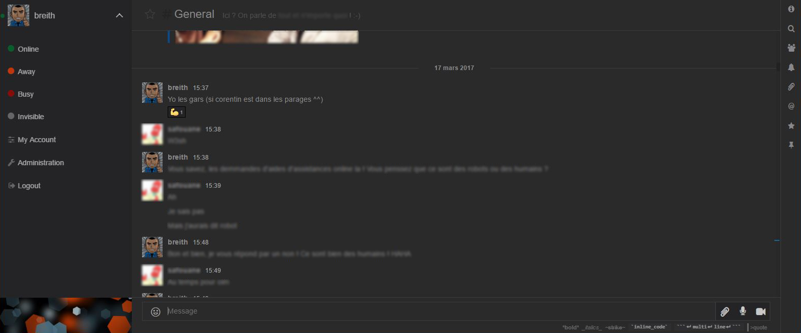

# Rocket.Chat Theme - Blackbort

> Custom theme for Rocket.Chat

<br>

## Visual



<br>

## Usage

1. Administration > Layout > Color :
    - Content Background Color : **#2A2A2A** | **color**
    - Primary Background Color : **#242425** | **color**
    - Primary Font Color : **#888889** | **color**
    - Primary Action Color : **#13679A** | **color**
    - Secondary Background Color : **#242425** | **color**
    - Secondary Font Color : **#A0A0A0** | **color**
    - Secondary Action Color : **#DDDDDD** | **color**
    - Component Color : **#3D3D3E** | **color**
    - Success Color : **#095C2C** | **color**
    - Pending Color : **#BF360C** | **color**
    - Error Color : **#870D0D** | **color**
    - Selection Color : **#0D4987** | **color**
    - theme-color-attention-color : **#9C27B0** | **color**

<br>

2. Administration > Layout > Custom CSS :
    ```css
    * {
        border-radius: 0 !important;
    }
    
    .message .reactions > li.selected {
        border-color: #3D3D3E;
        background-color: #242425;
    }
    
    .message .reactions > li {
        border-color: #000;
        background-color: #242425;
    }
    
    .code-colors {
        background-color: #333334;
        border-color: #333334;
        color: #FFF;
    }
    
    .side-nav .footer {
        background: url(/assets/logo) 50% no-repeat;
        background-size: cover;
    }
    
    .message-form .message-buttons:hover {
        background-color: #1D1D1F;
    }
    
    .page-settings .section {
        border: 1px solid #3D3D3E;
        background-color: #282828;
    }
    
    .page-settings .section-content .input-line {
        border-bottom: 1px solid #3D3D3E;
    }
    
    .message-form .message-form-text.editing {
        background-color: #222;
    }
    
    .background-info-font-color {
        background-color: #0D4987;
    }
    
    .hljs {
        display: block;
        overflow-x: auto !important;
        padding: 0.5em !important;
        background: #2B2B2B !important;
        color: #BABABA !important;
    }
    
    .hljs-strong,
    .hljs-emphasis {
        color: #A8A8A2 !important;
    }
    
    .hljs-bullet,
    .hljs-quote,
    .hljs-link,
    .hljs-number,
    .hljs-regexp,
    .hljs-literal {
        color: #6896BA !important;
    }
    
    .hljs-code,
    .hljs-selector-class {
        color: #A6E22E !important;
    }
    
    .hljs-emphasis {
        font-style: italic !important;
    }
    
    .hljs-keyword,
    .hljs-selector-tag,
    .hljs-section,
    .hljs-attribute,
    .hljs-name,
    .hljs-variable {
        color: #CB7832 !important;
    }
    
    .hljs-params {
        color: #B9B9B9 !important;
    }
    
    .hljs-string {
        color: #6A8759 !important;
    }
    
    .hljs-subst,
    .hljs-type,
    .hljs-built_in,
    .hljs-builtin-name,
    .hljs-symbol,
    .hljs-selector-id,
    .hljs-selector-attr,
    .hljs-selector-pseudo,
    .hljs-template-tag,
    .hljs-template-variable,
    .hljs-addition {
        color: #E0C46C !important;
    }
    
    .hljs-comment,
    .hljs-deletion,
    .hljs-meta {
        color: #7F7F7F !important;
    }
 
    .flex-tab input:focus,
    .flex-tab select:focus,
    .flex-tab textarea:focus {
        border-color: #888889;
    }
    ```

<br>

Enjoy!

## License

[MIT](LICENSE)